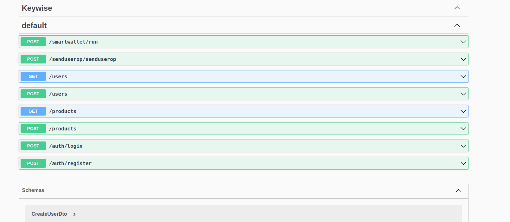

video show how works https://youtu.be/CqAxhgDUxzQ

project 
front: https://github.com/leanlp/hackaton
backend: https://github.com/leanlp/keywiseBackend
this repo: https://github.com/leanlp/KeywiseSendUserOp

video Encode-userOp Linkedin https://www.linkedin.com/feed/update/urn:li:activity:7090768160617811968?updateEntityUrn=urn%3Ali%3Afs_feedUpdate%3A%28V2%2Curn%3Ali%3Aactivity%3A7090768160617811968%29&lipi=urn%3Ali%3Apage%3Ad_flagship3_profile_view_base%3BcfLftJfWRHeY1Ppa9RAokQ%3D%3D

video Encode-userOp swap spanish https://www.linkedin.com/feed/update/urn:li:activity:7092481148466999296?updateEntityUrn=urn%3Ali%3Afs_feedUpdate%3A%28V2%2Curn%3Ali%3Aactivity%3A7092481148466999296%29&lipi=urn%3Ali%3Apage%3Ad_flagship3_profile_view_base%3BcfLftJfWRHeY1Ppa9RAokQ%3D%3D
